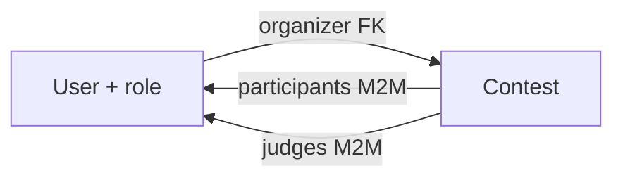
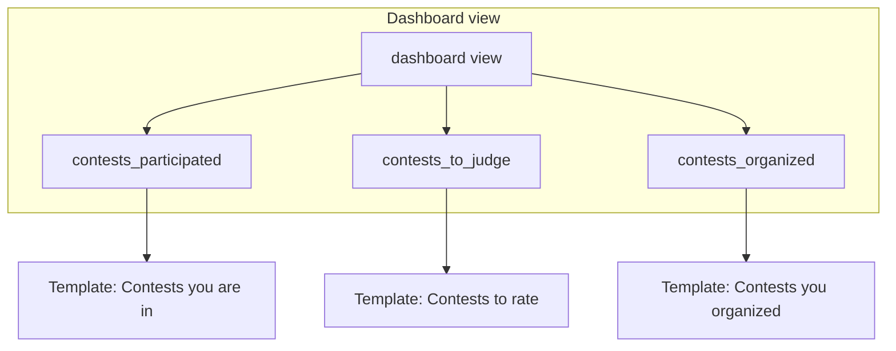

# Role-based contest visualizations (plan only)

## Current state

- **User** ([ContestKeeper/app/models.py](ContestKeeper/app/models.py)): has `role` with choices `ADMIN`, `JUDGE`, `PARTICIPANT`; no link to contests.
- **Contest**: has `name`, `description`, `start_date`, `end_date`; **no relations to users** (no organizer, participants, or jury).
- **Home** ([ContestKeeper/app/views.py](ContestKeeper/app/views.py)): renders [app/index.html](ContestKeeper/app/templates/app/index.html) with no contest or role data. Nav has a Dashboard button pointing to `#` ([app/nav.html](ContestKeeper/app/templates/app/nav.html)).

So to support “contesters see their contests, jury see contests to rate, organizers see contests they organized,” you need both **model relations** and **role-based views/templates**.

---

## 1. Data model: link contests to users

Add relations so that each contest has an organizer, a set of participants, and a set of judges.

| Relation     | Suggested model change                                                                             | Purpose                 |
| ------------ | -------------------------------------------------------------------------------------------------- | ----------------------- |
| Organizer    | `Contest.organizer` → `ForeignKey(User, on_delete=..., related_name='organized_contests')`         | “Contests I organized.” |
| Participants | `Contest.participants` → `ManyToManyField(User, related_name='contests_participated', blank=True)` | “Contests I’m in.”      |
| Judges       | `Contest.judges` → `ManyToManyField(User, related_name='contests_to_judge', blank=True)`           | “Contests I rate.”      |

Optional: add an **ORGANIZER** role to `User.Role` so that “organizers” are a distinct role; then the dashboard can show “Contests you organized” to users with that role (or to any user who has at least one `organized_contests`). Your current roles map as: **contesters** = PARTICIPANT, **jury** = JUDGE, **organizers** = new ORGANIZER (or reuse ADMIN if you prefer).

After changing models: create and run migrations.

---

## 2. Where to show the visualizations

Two straightforward options:

- **Option A – Dashboard page:** Keep Home as the current welcome page. Make **Dashboard** the role-based view: one URL (e.g. `/dashboard/`), one view that loads the right contests and passes a “view type” or role to the template, and one template that shows different sections/lists by role.
- **Option B – Home is the dashboard:** Turn the authenticated Home into the role-based contest view (participants / judges / organizers sections) so there is no separate Dashboard URL.

Recommendation: **Option A** — use the existing Dashboard entry in the nav and point it to a new dashboard view so Home stays a simple welcome and all “my contests” logic lives in one place.

---

## 3. View logic (single dashboard view)

One view (e.g. `dashboard`) that:

1. Requires login; redirect anonymous users to login or register.
2. Loads contests according to the current user:
  - **Participant:** `request.user.contests_participated.all()` (or filter by `participants=request.user`).
  - **Judge:** `request.user.contests_to_judge.all()`.
  - **Organizer:** `request.user.organized_contests.all()` (using the new FK).
3. Passes these querysets (and possibly the user’s role) to the template, e.g. `context = { 'contests_participated': ..., 'contests_to_judge': ..., 'contests_organized': ... }`. The template can show only the sections that have data or that apply to the role (e.g. show “Contests you’re in” only to participants and only if the list is non-empty, and similarly for judges and organizers).

If a user can have multiple roles (e.g. both JUDGE and PARTICIPANT), the same view can pass all three lists and the template shows each non-empty section.

---

## 4. Template structure (one dashboard, role-based sections)

Single dashboard template (e.g. `app/dashboard.html`) that receives the three contest lists (and optionally `user.role`).

- **Participants (contesters):** e.g. a block “Contests you’re in” listing `contests_participated` (name, dates, link to contest if you add detail URLs later).
- **Judges (jury):** “Contests to rate” listing `contests_to_judge`.
- **Organizers:** “Contests you organized” listing `contests_organized`.

You can:

- Show only the section(s) relevant to the current role, or  
- Show all three sections and hide empty ones (so multi-role users see all applicable lists).

Reuse the same contest card/list markup for each section to keep styling consistent. No need for separate “contester view” / “jury view” / “organizer view” pages unless you later want separate URLs for each.

---

## 5. URLs and nav

- Add a URL for the dashboard view, e.g. `path('dashboard/', views.dashboard, name='dashboard')` in [app/urls.py](ContestKeeper/app/urls.py).
- In [app/nav.html](ContestKeeper/app/templates/app/nav.html), set the Dashboard button’s `data-url` to ``.

---

## 6. Optional: who can create contests and assign roles

Not strictly required for “different visualizations by role,” but you’ll need a way to populate organizer/participants/judges:

- **Create contest:** A form or admin action that creates a `Contest` and sets `organizer=request.user` (and optionally restricts creation to ADMIN or ORGANIZER role).
- **Assign participants/judges:** Admin and/or in-app UI to add users to `contest.participants` and `contest.judges` (e.g. multi-select by user or by role). Can be done in Django admin first (using the new M2M fields), then in-app later.

---

## Summary diagram

---

## Implementation order (when you implement)

1. Extend **Contest** model: add `organizer` (FK), `participants` (M2M), `judges` (M2M); optionally add **ORGANIZER** to `User.Role`; create and run migrations.
2. Add **dashboard** view and URL; require login; pass the three contest querysets (and optionally role) to the template.
3. Add **dashboard template** with three sections (contests you’re in / to rate / organized), showing only non-empty or role-relevant sections.
4. Point **nav** Dashboard button to ``.
5. (Later) Add contest creation and assignment of participants/judges (admin or in-app) so data exists for the dashboard.

No code changes are made in this step; this is a plan only.