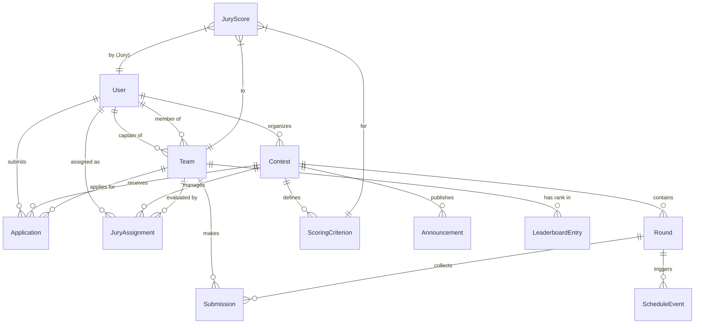
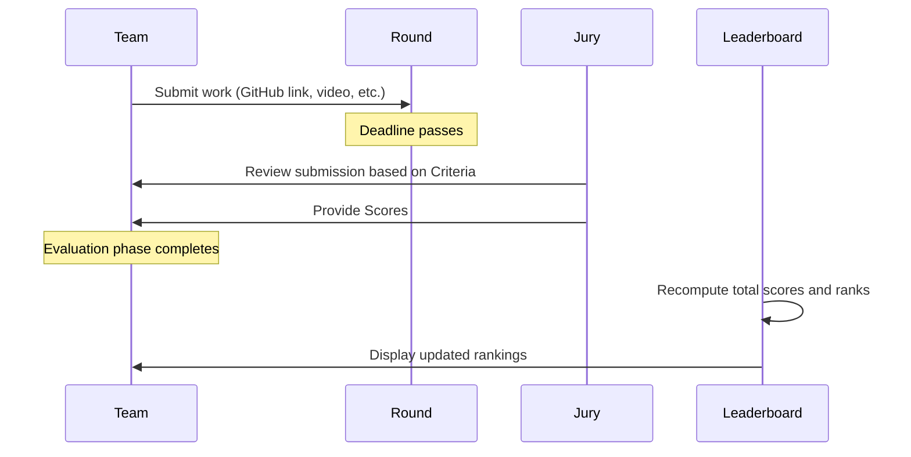

# System Architecture: ContestKeeper

This document describes the high-level architecture of ContestKeeper, including the core data models, user roles, and system workflows.

## 1. High-Level Overview

ContestKeeper is a Django-based web application designed to facilitate the organization, management, and evaluation of competitive events (contests). It handles everything from participant registration to jury evaluation and real-time leaderboard updates.

## 2. User Roles

The system defines three primary user roles:

| Role | Description | Key Permissions |
|------|-------------|-----------------|
| **Organizer** | The contest administrator. | Create/edit contests, manage applications, assign jury members, manage rounds. |
| **Jury** | Subject matter experts who evaluate submissions. | View assigned team submissions, provide scores based on defined criteria. |
| **Participant** | Individuals or teams competing in the contest. | Create/join teams, apply for contests, submit work for rounds, view results. |

## 3. Core Entities (ER Diagram)

The following Mermaid diagram illustrates the relationships between the core entities in the system:

## 4. Key Workflows

### 4.1 Contest Lifecycle

1. **Draft**: Organizer creates a contest and configures rounds, criteria, and details.
2. **Registration**: Contest is open for participants and teams to apply.
3. **Running**: Contest is active; rounds are being released and submissions collected.
4. **Finished**: Contest ends; final evaluations are completed and leaderboard is finalized.

### 4.2 Submission and Evaluation Flow

## 5. Technology Stack

- **Backend**: Django (Python)
- **Database**: PostgreSQL / SQLite (Development)
- **Real-time**: Django Channels (WebSockets)
- **Frontend**: HTML5, Vanilla CSS, JavaScript
- **Background Tasks**: Management commands for scheduled operations.
